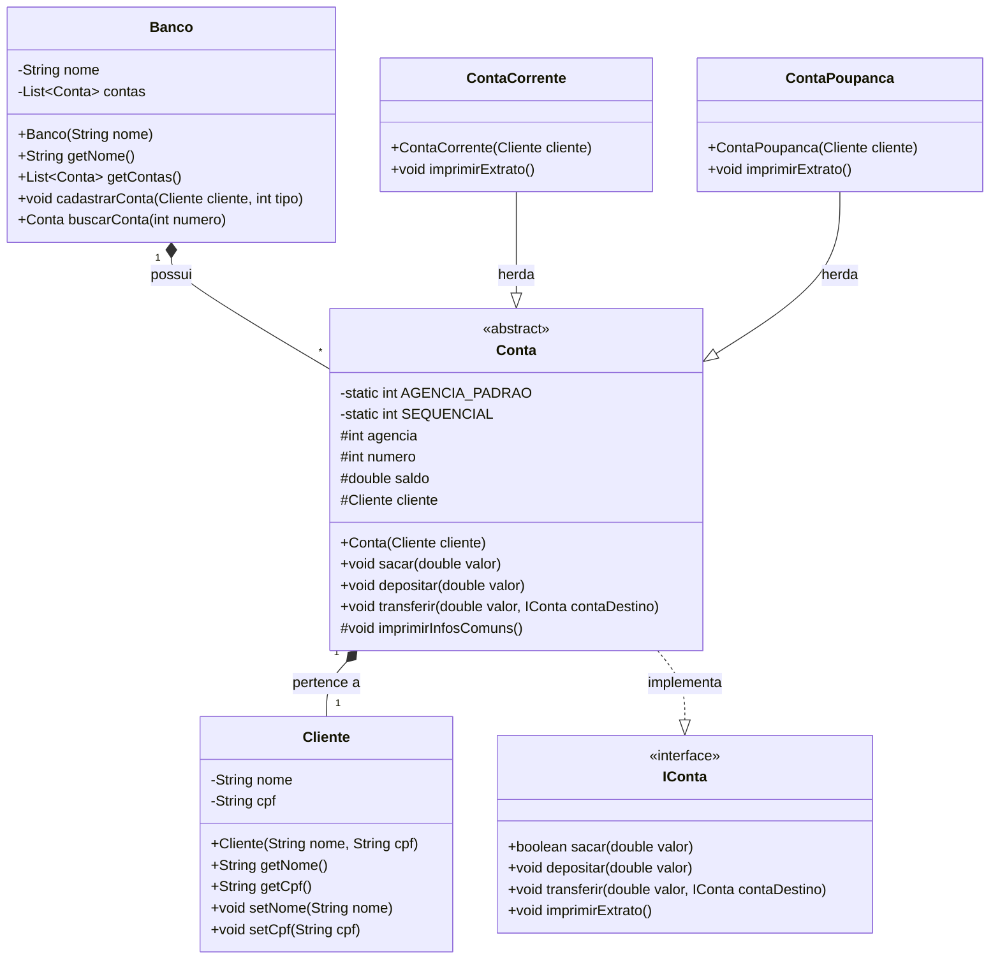

# Banco Digital POO - JavaBank Pro

Este é um projeto de um sistema bancário simples desenvolvido em Java, focado na aplicação dos pilares da Programação Orientada a Objetos (POO): Abstração, Encapsulamento, Herança e Polimorfismo.

## Diagrama de Classes UML



## 🚀 Funcionalidades

O sistema permite realizar operações bancárias via console (CLI) e persiste os dados em um arquivo de texto (`banco_dados.txt`), simulando um banco de dados real.

### Gestão de Clientes e Contas
- **Cadastrar Conta:** Criação de Conta Corrente (com limite) ou Conta Poupança.
- **Alterar Dados:** Modificação do nome do titular.
- **Excluir Conta:** Remoção lógica da conta do sistema.
- **Relatório:** Listagem de todas as contas cadastradas.

### Operações Financeiras
- **Depósito:** Adicionar fundos a uma conta.
- **Saque:** Retirar fundos (com validação de saldo e limite para Conta Corrente).
- **Transferência:** Mover valores entre contas (origem -> destino).
- **Extrato:** Visualização detalhada do saldo e limites.

## 🛠️ Tecnologias Utilizadas

- **Java (JDK 8+)**: Linguagem principal.
- **Java IO**: Para persistência de dados em arquivo (`FileWriter`, `BufferedReader`).
- **Java Collections**: Uso de `List` e `ArrayList` para gerenciamento em memória.
- **Java Streams**: Para busca otimizada de contas.

## 📂 Estrutura do Projeto

- `Main.java`: Ponto de entrada e menus do sistema.
- `Banco.java`: Gerenciador das contas e persistência de dados.
- `Cliente.java`: Representação do cliente (titular).
- `IConta.java`: Interface que define o contrato das operações.
- `Conta.java`: Classe abstrata com a lógica base.
- `ContaCorrente.java`: Implementação específica com cheque especial.
- `ContaPoupanca.java`: Implementação específica para poupança.

## ▶️ Como Executar

1. Certifique-se de ter o Java instalado.
2. Compile os arquivos na pasta `src`:
   ```bash
   javac *.java
   ```
3. Execute a classe Main:
   ```bash
   java Main
   ```